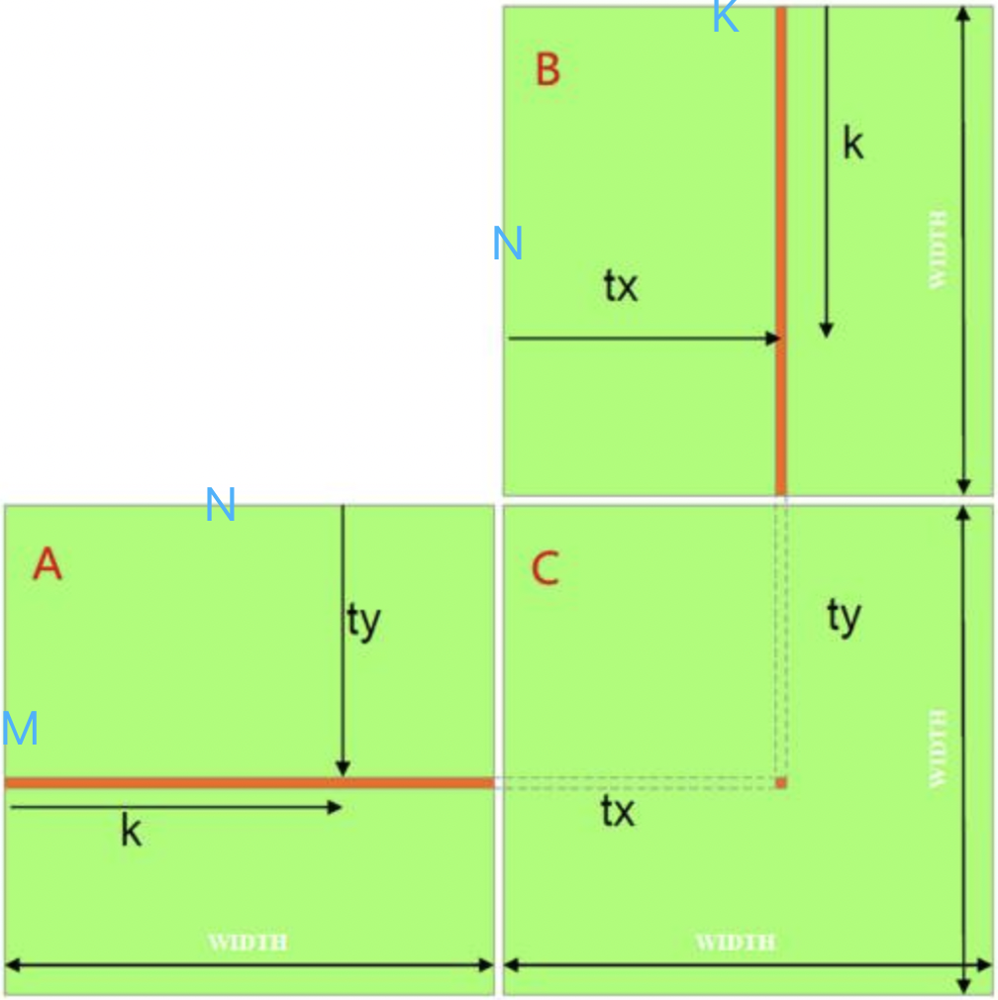
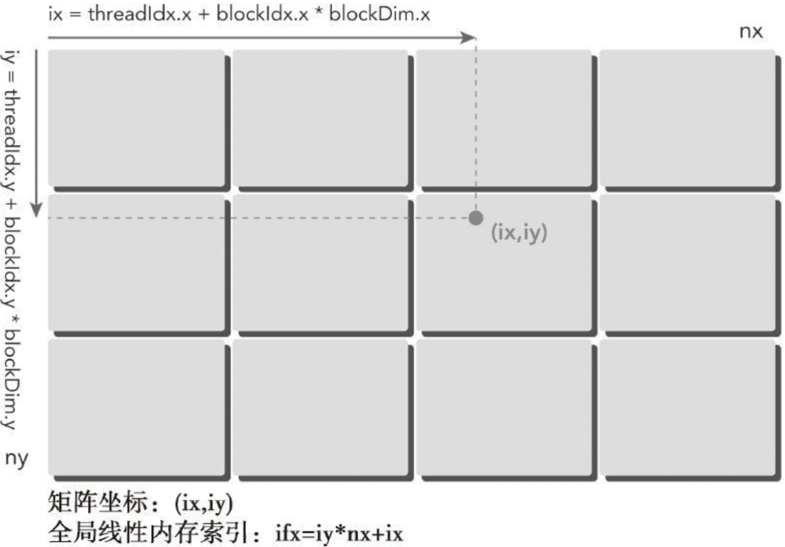
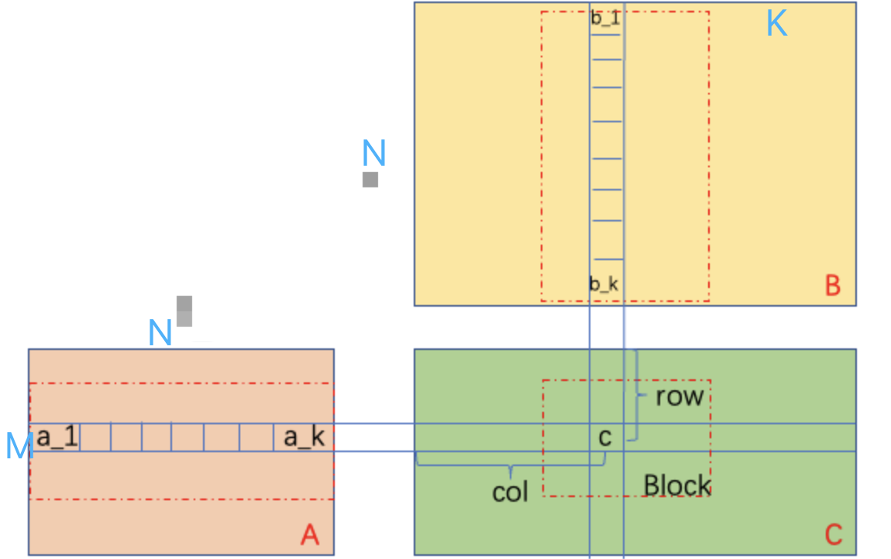
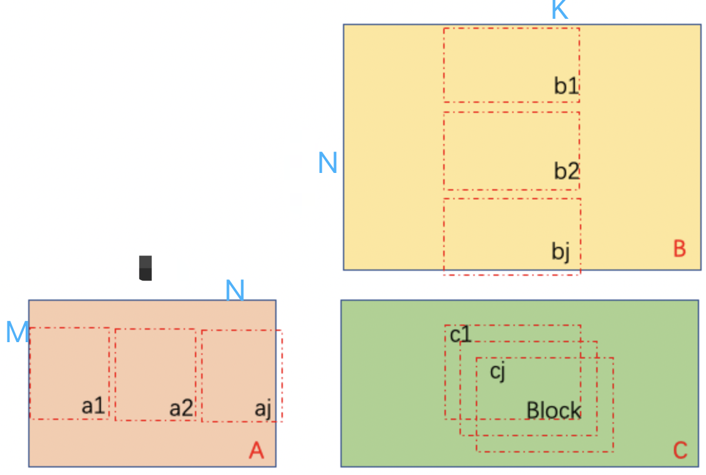

# CUDA 矩阵乘 优化

**矩阵A(MxN) * 矩阵B(NxK)  = 矩阵C(MxK)  (M行K列)**



## method 1 host 实现

```c++
void gemmOnHost(float *A, float *B, float *C, const int M, const int N, const int K){
    for(int mi=0; mi<M; ++mi){
        for(int ki=0; ki<K; ++ki){
            for(int ni=0; ni<N; ++ni){  // 遍历 A B 相同维度 N
                C[mi*K + ki] += A[mi*N + ni] * B[ni*K + ki];
            }
        }
    }
    return;
}
```

## method 2 简单版本

```c++
__global__ void gemmOnGPU2D(float *A, float *B, float *C, int M, int N, int K){    
    unsigned int ixk = blockIdx.x * blockDim.x + threadIdx.x;
    unsigned int iym = blockIdx.y * blockDim.y + threadIdx.y;
    if (ixk < K && iym < M){
        float sum = 0;
        for(int ni=0; ni<N; ++ni){
            sum += A[iym*N + ni] * B[ni*K + ixk];
        }
        C[iym*K + ixk] = sum;
    }
}
// 
// 
```

host调用方式：

```c++
gemmOnGPU2D<<<((K+block.x-1)/block.x, (M+block.y-1)/block.y), (32, 32)>>>(d_MatA, d_MatB, d_MatC, M, N, K);
```

线程索引方式参考：



## method 3 共享内存



#### 方法讲解：

​	参考上图，就是将每一个block中矩阵A和矩阵B中用到的参数加载到share mem中，在计算时候提高计算访存比；

```c++
__global__ void gemmOnGPU2DShareMem(float *A, float *B, float *C, const int M, const int N, const int K){    
    extern __shared__ float block_AB[];  
    unsigned int ixk = blockIdx.x * blockDim.x + threadIdx.x;
    unsigned int iym = blockIdx.y * blockDim.y + threadIdx.y;
    if (ixk < K && iym < M){
        for(int ni=0; ni<N; ++ni){
            block_AB[threadIdx.y*N + ni] = A[iym*N + ni];  
            block_AB[blockDim.y*N + ni*blockDim.x + threadIdx.x] = B[ni*K + ixk];  
        }
        __syncthreads();
        float sum = 0;
        for(int ni=0; ni<N; ++ni){
            sum += block_AB[threadIdx.y*N + ni] * block_AB[blockDim.y*N + ni*blockDim.x + threadIdx.x];
        }
        C[iym*K + ixk] = sum;
    }
}
```

host调用方式：

```c++
int shareMemSize = dimx*nn + dimy*nn;  // 动态共享内存大小
gemmOnGPU2DShareMem<<<((K+block.x-1)/block.x, (M+block.y-1)/block.y), (32, 32),shareMemSize*sizeof(float)>>>(d_MatA, d_MatB, d_MatC, M, N, K);
```

#### 缺点：

- 使用的共享内存有点多： block share mem size = blockDim.x \* N + blockDim.y \* N

#### 遇到问题

- 1 一个kernel只能分配一块共享内存，可以使用下面的方式分配到不同变量：

  ```c++
  extern __shared__ float smem[];
  float *sharedM = smem;                       
  float *sharedN = (float*)&smem[blockDim.x * blockDim.y]; 
  ```


## method 4 共享内存提升



#### 方法讲解：

主要是针对方法3中占用大量共享内存的问题做了进一步优化；目前每块共享内存：block share mem size = blockDim.x\*blockDim.y\*2

```c++
__global__ void gemmOnGPU2DShareMemV2(float *A, float *B, float *C, const int M, const int N, const int K){
    extern __shared__ float smem[];
    float *sharedM = smem;                       
    float *sharedN = (float*)&smem[blockDim.x * blockDim.y]; 
    int row = blockIdx.y * blockDim.y + threadIdx.y;
    int col = blockIdx.x * blockDim.x + threadIdx.x;
    if (row < M && col < K){
        float Csub = 0.0;
        for (int i = 0; i < (int)(ceil((float)N / blockDim.x)); i++){
            if (i*blockDim.x + threadIdx.x < N) 
                sharedM[threadIdx.y*blockDim.x + threadIdx.x] = A[row*N + i * blockDim.x + threadIdx.x];
            else
                sharedM[threadIdx.y*blockDim.x + threadIdx.x] = 0.0;
            if (i*blockDim.y + threadIdx.y < N) 
                sharedN[threadIdx.y*blockDim.x + threadIdx.x] = B[(i*blockDim.y + threadIdx.y)*K + col];
            else
                sharedN[threadIdx.y*blockDim.x + threadIdx.x] = 0.0;
            __syncthreads();

            for (int j = 0; j < blockDim.x; j++)
                Csub += sharedM[threadIdx.y*blockDim.x + j] * sharedN[j*blockDim.y + threadIdx.x];
            __syncthreads();
        }
        C[row*K + col] = Csub;
    }
}
```

host调用方式：

```c++
// 上面的实现要求 blockDim.x == blockDim.y
int shareMemSize = dimx*nn + dimy*nn;  // 动态共享内存大小
gemmOnGPU2DShareMemV2<<<((K+block.x-1)/block.x, (M+block.y-1)/block.y), (32, 32),shareMemSize*sizeof(float)>>>(d_MatA, d_MatB, d_MatC, M, N, K);
```


## method 5 共享内存 + 寄存器

#### 方法讲解：

```c++
__global__ void gemmOnGPU2DRegMem(float *A, float *B, float *C, int M, int N, int K){
    int row = blockIdx.y * blockDim.y * 2  + threadIdx.y;
    int col = blockIdx.x * blockDim.x + threadIdx.x;
    float val[2] = {0.0f};
    const int BLOCK_SIZE = 32;
    __shared__ float shTileA[BLOCK_SIZE][BLOCK_SIZE];
    __shared__ float shTileB[BLOCK_SIZE][BLOCK_SIZE];

    int iter = (N + BLOCK_SIZE - 1) / BLOCK_SIZE;
    if(row < M && col < K){
        for(int i = 0; i < iter; i++){
            shTileA[threadIdx.y][threadIdx.x]=A[row * N+i*BLOCK_SIZE+threadIdx.x];
            shTileA[threadIdx.y+16][threadIdx.x]=A[(row+16)*N+i*BLOCK_SIZE+threadIdx.x];

            shTileB[threadIdx.y][threadIdx.x]=B[(i*BLOCK_SIZE+threadIdx.y)*N+col];
            shTileB[threadIdx.y+16][threadIdx.x]=B[(i*BLOCK_SIZE+threadIdx.y+16)*N+col];
            __syncthreads();

            for(int j = 0; j < BLOCK_SIZE; j++){
                val[0] += shTileA[threadIdx.y][j] * shTileB[j][threadIdx.x];
                val[1] += shTileA[threadIdx.y + 16][j] * shTileB[j][threadIdx.x];
            }
            __syncthreads();
        }
        C[row * N + col] = val[0];
        C[(row + 16) * N + col] = val[1];
    }
}
```

host调用方式：

```c++
dim3 block5(32, 32/2);
dim3 grid5((nk + block.x - 1) / block.x, (nm + block.y - 1) / block.y);
gemmOnGPU2DRegMem<<<grid5, block5>>>(d_MatA, d_MatB, d_MatC, nm, nn, nk);
// 下面的实现方式要求 M==N==K, BLOCK_SIZE = 32 blockDim.x=32,  blockDim.y = BLOCK_SIZE / 2
```

目前这个方法还有些不完善


# 针对上面方法做的实验优化：

  